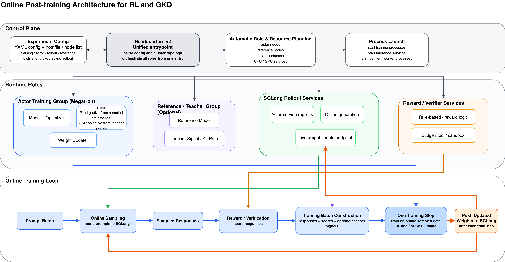
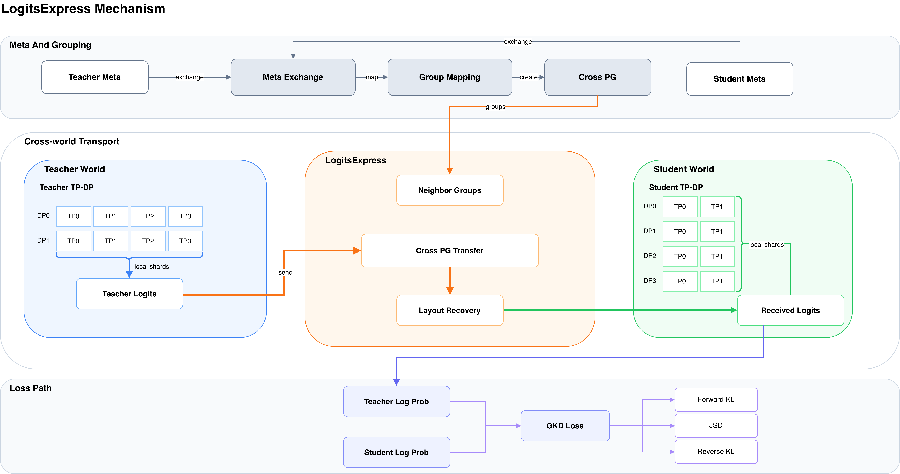
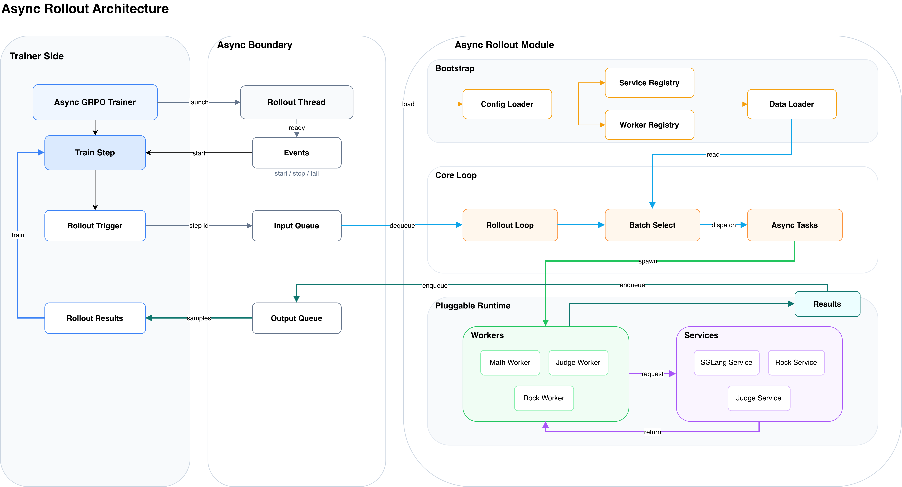

## Key Differentiators

### Complete distributed GKD implementation

LiteScale does not reduce GKD to a toy single-node path. It includes a distributed implementation intended for practical large-model post-training, including online logit transport and support for multiple divergence objectives.

### Ray-free, debug-friendly system design

The framework favors explicit process roles, configuration-driven launch, and modular services over a heavyweight distributed control plane. This keeps failure surfaces easier to inspect and makes node-level debugging substantially more tractable.

### One stack for three major post-training workloads

The same framework supports:

- online GKD
- GRPO reinforcement learning
- SFT

This reduces the amount of duplicated infrastructure between algorithm experiments.

### Flexible rollout module

The async rollout subsystem is designed as an extensible layer rather than a fixed implementation detail. New service types, workers, verifiers, and tool-using flows can be integrated without rewriting the whole trainer stack.

## Method and System Architecture

[Figure 1 source](docs/figure1_online_rl_gkd_architecture.drawio)

This figure should appear here after it is prepared. Its role is to establish the global system view for LiteScale:

- Megatron-based actor training
- optional reference-model path
- SGLang rollout services
- reward or verifier path
- online response collection
- online weight or logit interaction between training and serving components

At the README level, this section should give readers one mental model for the entire framework before zooming into individual mechanisms.

In LiteScale, the actor-side training loop remains Megatron-native, while inference and response generation are handled by decoupled rollout services. This separation allows RL and GKD to share the same high-level online-sampling architecture even when their optimization targets differ. The result is a framework that is easier to reason about operationally: training, serving, judging, and verification are separate concerns with explicit interfaces.

## GKD-specific Mechanism: LogitsExpress

[Figure 2 source](docs/figure2_logits_express_mechanism.drawio)

This figure should explain the mechanism-specific part of LiteScale's GKD path rather than repeat the global system view. It is intended to show:

- where teacher logits are produced
- how top-k logits are transported across distributed ranks
- how distributed log-softmax is reconstructed
- where forward KL, JSD, and reverse KL are applied
- how the distillation path plugs into the online training loop

The purpose of LogitsExpress is to make online distillation practical under distributed training constraints. Instead of forcing a dense, communication-heavy distillation path everywhere, LiteScale exposes a mechanism that can move the relevant teacher signal efficiently enough for large-model post-training.

## Async Rollout and Async GRPO Trainer Internals

[Figure 3 source](docs/figure3_async_rollout_architecture.drawio)

This figure should zoom into the asynchronous subsystem and clarify the software boundaries among:

- `async_rollout_v2/rollout_loop.py`
- `async_rollout_v2/services/`
- `async_rollout_v2/workers/`
- `async_rollout_v2/rollout_thread.py`
- `light_scale/async_grpo_trainer.py`

The async path is important because it turns rollout collection into a modular subsystem instead of a blocking implementation detail. This enables train-infer decoupling, service specialization, and a cleaner integration point for tool use, judging, or domain-specific verification flows.