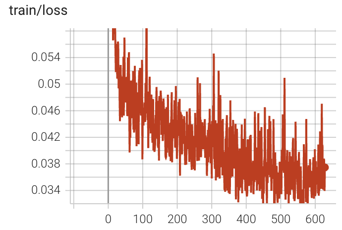

# Qwen3-8B GKD with Qwen3-32B 快速开始

这份 quickstart 用来说明如何使用 LiteScale 在DeepScaleR数据集上，用Qwen3-32B 作为教师模型，对 Qwen3-8B 做在线 GKD 蒸馏训练。

## 硬件要求

- 已验证环境：H800 80GB
- 建议最少卡数：24 卡

## 目标

- 数据集：DeepScaleR
- Student 模型：Qwen3-8B
- Teacher 模型：Qwen3-32B
- 训练类型：在线 GKD
- 产出内容：student checkpoints、student 和 teacher 日志，以及导出的 student Hugging Face checkpoint

## 开始前需要准备什么

先准备数据集：

```bash
wget https://modelscope.cn/datasets/agentica-org/DeepScaleR-Preview-Dataset/resolve/master/deepscaler.json
```

再准备 student 和 teacher 模型：

```bash
git clone https://www.modelscope.cn/Qwen/Qwen3-8B.git
git clone https://www.modelscope.cn/Qwen/Qwen3-32B.git
```

接下来的操作示例默认你将数据和模型保存到下方位置：

- 数据集文件：`~/data/deepscaler.json`
- Student 模型目录：`~/models/Qwen3-8B`
- Teacher 模型目录：`~/models/Qwen3-32B`

## 目录文件说明

- [config.yml](config.yml)：在线 GKD 训练配置
- [01-process-dataset.sh](01-process-dataset.sh)：把原始 DeepScaleR JSON 处理成 async rollout 可用的数据集
- [02-convert-model.sh](02-convert-model.sh)：把 student 和 teacher 模型都转换成 LiteScale 使用的格式
- [03-train.sh](03-train.sh)：通过 `headquarters_v2.py` 启动 GKD 训练
- [04-convert-result.sh](04-convert-result.sh)：把训练后的 student checkpoint 导出成 Hugging Face 格式
- [process_deepscaler_for_gkd.py](process_deepscaler_for_gkd.py)：GKD 路径的数据处理逻辑

## 第一步：处理数据集

目的：
把 DeepScaleR 样本处理成 student rollout 路径所需的 chat-template prompt。

脚本：
[01-process-dataset.sh](01-process-dataset.sh)

参数说明：

- `$1`：student tokenizer 或模型路径
- `$2`：原始数据集 JSON 路径

示例：

```bash
cd quickstarts/Qwen3-8B_GKD_Qwen3-32B
bash 01-process-dataset.sh ~/models/Qwen3-8B ~/data/deepscaler.json
```

这个脚本会做几件事：

- 调用 [process_deepscaler_for_gkd.py](process_deepscaler_for_gkd.py)
- 使用 Qwen chat template，并设置 `enable_thinking=False`
- 将处理后的 Hugging Face 数据集写到 `./deepscaler_gkd`

## 第二步：转换 student 和 teacher 模型

目的：
同时为分布式训练链路和 serving 链路准备 student 与 teacher 两套模型。

脚本：
[02-convert-model.sh](02-convert-model.sh)

参数说明：

- `$1`：student 模型路径
- `$2`：teacher 模型路径

示例：

```bash
cd quickstarts/Qwen3-8B_GKD_Qwen3-32B
bash 02-convert-model.sh ~/models/Qwen3-8B ~/models/Qwen3-32B
```

这个脚本会做几件事：

- 创建 HF 软链接：
  `../../hf_models/Qwen3-8B`
  `../../hf_models/Qwen3-32B`
- 将 student 模型转换到 Megatron 格式：
  `../../megatron_models/Qwen3-8B`
- 将 teacher 模型转换到 Megatron 格式：
  `../../megatron_models/Qwen3-32B`

## 第三步：启动在线 GKD 训练

目的：
训练 student 模型，同时把 teacher 作为 reference / distillation 信号来源。

脚本：
[03-train.sh](03-train.sh)

示例：

```bash
cd quickstarts/Qwen3-8B_GKD_Qwen3-32B
bash 03-train.sh
```

实际执行的命令是：

```bash
python3 headquarters_v2.py --config ./quickstarts/Qwen3-8B_GKD_Qwen3-32B/config.yml
```

补充说明：
和 GRPO quickstart 一样，脚本里保留了提醒，多机训练前需要你自行设置 `NODE_RANK`、`NODE_LIST` 等分布式环境变量。

[config.yml](config.yml) 里比较关键的配置包括：

- `training.output_dir`：`./quickstarts/Qwen3-8B_GKD_Qwen3-32B/training_outputs`
- `training.from_pretrained`：`./megatron_models/Qwen3-8B`
- `training.max_steps`：`628`
- `training.rollout_batch_size`：`128`
- `training.global_batch_size`：`128`
- `training.n_samples`：`1`
- `distillation.enabled`：`True`
- `reference.load_path`：`./megatron_models/Qwen3-32B`
- `distillation.logits_express.batch_size`：`8`
- `distillation.gkd.gkd_sparse_topk_enabled`：`True`
- `distillation.gkd.gkd_topk`：`200`
- `actor.tp`：`2`
- `actor.pp`：`2`
- `reference.tp`：`8`
- `reference.pp`：`1`
- `async_rollout.data`：`./quickstarts/Qwen3-8B_GKD_Qwen3-32B/deepscaler_gkd`

这些配置对应的是一条标准的在线蒸馏路径：teacher 独立加载，启用 sparse top-k GKD，并且每个 prompt 只生成一个 rollout 样本。

## 第四步：把最终 student checkpoint 转回 Hugging Face 格式

目的：
导出蒸馏完成后的 student checkpoint。

脚本：
[04-convert-result.sh](04-convert-result.sh)

参数说明：

- `$1`：原始 student base model 路径

示例：

```bash
cd quickstarts/Qwen3-8B_GKD_Qwen3-32B
bash 04-convert-result.sh ~/models/Qwen3-8B
```

输出位置：

- 最终 Hugging Face student checkpoint：
  `./training_outputs/hf_checkpoints/step_600`

## 到哪里看训练进度

- Student 训练日志：
  `./training_outputs/actor_log`
- Teacher / Reference 日志：
  `./training_outputs/ref_log`
- 训练过程中保存的 Megatron checkpoints：
  `./training_outputs/checkpoints`
- 导出的 student checkpoint：
  `./training_outputs/hf_checkpoints/step_600`

如果你的运行环境启用了 TensorBoard，日志通常也会落在 `training_outputs` 目录树下面。

## 训练结果参考



## 最小跑通示例

```bash
cd quickstarts/Qwen3-8B_GKD_Qwen3-32B
bash 01-process-dataset.sh ~/models/Qwen3-8B ~/data/deepscaler.json
bash 02-convert-model.sh ~/models/Qwen3-8B ~/models/Qwen3-32B
bash 03-train.sh
bash 04-convert-result.sh ~/models/Qwen3-8B
```

## 一句话总结

如果你的目标是在线师生蒸馏，而不是纯 SFT 或标准 GRPO，这条路径就是对应的起点。先准备好 student 和 teacher 两套模型，再按四个脚本顺序执行即可。