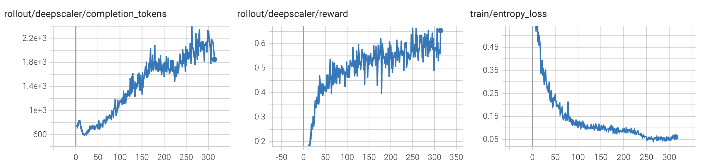

# Qwen3-8B GRPO 快速开始

这份 quickstart 说明如何使用 LiteScale 对Qwen3-8B-Base 在 DeepScaleR 数据集上做 GRPO 强化学习训练。

## 硬件要求

- 已验证：H800 80GB
- 建议最少卡数：16 卡

## 目标

- 数据集：DeepScaleR
- 模型：Qwen3-8B-Base
- 训练类型：带异步 rollout 的 GRPO
- 产出内容：actor checkpoints、rollout experiences、TensorBoard 日志，以及导出的 Hugging Face checkpoint

## 训前准备

先准备数据集：

```bash
wget https://modelscope.cn/datasets/agentica-org/DeepScaleR-Preview-Dataset/resolve/master/deepscaler.json
```

再准备千问3 8B Base模型：

```bash
git clone https://www.modelscope.cn/Qwen/Qwen3-8B-Base.git
```

接下来的操作示例默认你将数据和模型保存到下方位置：

- 数据集文件：`~/data/deepscaler.json`
- 基础模型目录：`~/models/Qwen3-8B-Base`

## 本目录文件说明

- [config.yml](config.yml)：异步 GRPO 训练配置
- [01-process-dataset.sh](01-process-dataset.sh)：把原始 DeepScaleR JSON 处理成 async rollout 可用的数据集
- [02-convert-model.sh](02-convert-model.sh)：把基础模型转成 Megatron 格式
- [03-train.sh](03-train.sh)：通过 `headquarters_v2.py` 启动 GRPO 训练
- [04-convert-result.sh](04-convert-result.sh)：把最终 actor checkpoint 导出成 Hugging Face 格式
- [process_deepscaler_for_ds_r1_zero.py](process_deepscaler_for_ds_r1_zero.py)：数据处理脚本

## 第一步：处理数据集

目的：
把 DeepScaleR 样本处理成 GRPO rollout worker 所需的 prompt、ground_truth 和 dataset_type 字段。

脚本：
[01-process-dataset.sh](01-process-dataset.sh)

参数说明：

- `$1`：原始数据集 JSON 路径

示例：

```bash
cd quickstarts/Qwen3-8B_GRPO
bash 01-process-dataset.sh ~/data/deepscaler.json
```

这个脚本会做几件事：

- 调用 [process_deepscaler_for_ds_r1_zero.py](process_deepscaler_for_ds_r1_zero.py)
- 将处理后的 Hugging Face 数据集写到 `./deepscaler_r1_zero`
- 生成符合当前 GRPO rollout 流程要求的 reasoning 风格 prompt

## 第二步：转换基础模型

目的：
同时准备训练使用的 Megatron checkpoint 和 rollout service 使用的 Hugging Face 模型路径。

脚本：
[02-convert-model.sh](02-convert-model.sh)

参数说明：

- `$1`：基础模型路径

示例：

```bash
cd quickstarts/Qwen3-8B_GRPO
bash 02-convert-model.sh ~/models/Qwen3-8B-Base
```

这个脚本会做几件事：

- 创建 `../../hf_models/Qwen3-8B-Base` 软链接，指向原始模型目录
- 将模型转换到 `../../megatron_models/Qwen3-8B-Base`

## 第三步：启动 GRPO 训练

脚本：
[03-train.sh](03-train.sh)

示例：

```bash
cd quickstarts/Qwen3-8B_GRPO
bash 03-train.sh
```

实际执行的命令是：

```bash
python3 headquarters_v2.py --config ./quickstarts/Qwen3-8B_GRPO/config.yml
```

补充说明：
脚本里保留了提醒，你需要在多机训练前自行设置好 `NODE_RANK`、`NODE_LIST` 等分布式环境变量。

[config.yml](config.yml) 里比较关键的配置包括：

- `training.output_dir`：`./quickstarts/Qwen3-8B_GRPO/training_outputs`
- `training.rollout_batch_size`：`128`
- `training.global_batch_size`：`1024`
- `training.n_samples`：`8`
- `training.max_steps`：`314`
- `training.skip_zero_reward_sample`：`True`
- `algorithm.advantage_estimator`：`grpo`
- `actor.tp`：`2`
- `actor.pp`：`2`
- `actor.dp`：`2`
- `async_rollout.data`：`./quickstarts/Qwen3-8B_GRPO/deepscaler_r1_zero`
- `async_rollout.services[0].resource_cfg.params.model_path`：`./hf_models/Qwen3-8B-Base`
- `async_rollout.workers[0].params.max_tokens`：`6500`
- `async_rollout.workers[1].type`：`math`

这些配置对应的是一条标准的 LiteScale 在线 RL 路径：使用 SGLang actor service、每个 prompt 采样 8 个分支，并针对 `deepscaler` 数据类型启用 math worker。

## 第四步：把最终 actor checkpoint 转回 Hugging Face 格式

目的：
导出训练后的 actor checkpoint，方便后续推理或评测使用。

脚本：
[04-convert-result.sh](04-convert-result.sh)

参数说明：

- `$1`：原始基础模型路径

示例：

```bash
cd quickstarts/Qwen3-8B_GRPO
bash 04-convert-result.sh ~/models/Qwen3-8B-Base
```

输出位置：

- 最终 Hugging Face checkpoint：
  `./training_outputs/hf_checkpoints/step_300`

## 到哪里看训练进度

- Actor 训练日志：
  `./training_outputs/actor_log/rank_0.log`
- TensorBoard 日志目录：
  `./training_outputs/tensorboard_log/`
- Rollout experiences：
  `./training_outputs/experiences/`
- Megatron checkpoints：
  `./training_outputs/checkpoints`

常见的 TensorBoard 查看方式：

```bash
tensorboard --logdir quickstarts/Qwen3-8B_GRPO/training_outputs/tensorboard_log
```

## 最小跑通示例

```bash
cd quickstarts/Qwen3-8B_GRPO
bash 01-process-dataset.sh ~/data/deepscaler.json
bash 02-convert-model.sh ~/models/Qwen3-8B-Base
bash 03-train.sh
bash 04-convert-result.sh ~/models/Qwen3-8B-Base
```

## 训练结果参考



## 一句话总结

如果你要体验 LiteScale 标准的在线强化学习工作流，这条路径最直接：在线采样、reward 驱动更新、异步 rollout，以及最终 actor 模型导出。