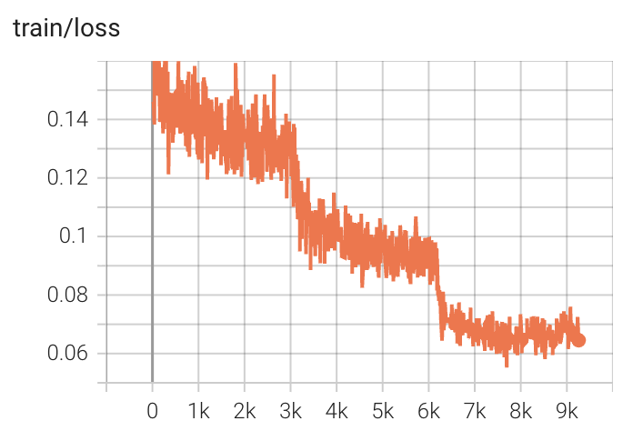

# Qwen3-8B SFT Quickstart

This quickstart shows how to use LiteScale to run supervised fine-tuning on the MetaMathQA dataset with the Qwen3-8B-Base model.

## Hardware Requirement

- Verified target GPU: H800 80GB
- Minimum GPU count for this quickstart: 8 GPUs

## Goal

- Dataset: MetaMathQA-395K
- Model: Qwen3-8B-Base
- Training type: SFT
- Output: Megatron-format checkpoints during training and a final Hugging Face checkpoint after conversion

## What You Need to Prepare in Advance

Download the dataset JSON file:

```bash
wget https://modelscope.cn/datasets/swift/MetaMathQA/resolve/master/MetaMathQA-395K.json
```

Download the base model:

```bash
git clone https://www.modelscope.cn/Qwen/Qwen3-8B-Base.git
```

Recommended workspace assumption for the examples below:

- Repository root: `Megatron-RL-Dumped`
- Dataset file: `~/data/MetaMathQA-395K.json`
- Base model directory: `~/models/Qwen3-8B-Base`

## Files in This Directory

- [config.yml](config.yml): training configuration used by `headquarters.py`
- [01-process-dataset.sh](01-process-dataset.sh): converts raw MetaMathQA JSON into a packed Hugging Face dataset
- [02-convert-model.sh](02-convert-model.sh): converts the base model into Megatron checkpoint format
- [03-train.sh](03-train.sh): launches SFT training
- [04-convert-result.sh](04-convert-result.sh): converts the final Megatron checkpoint back to Hugging Face format
- [convert_metamathqa_to_qwen3.py](convert_metamathqa_to_qwen3.py): dataset conversion logic

## Step 1: Process the Dataset

Purpose:
Convert MetaMathQA into the chat format of Qwen3, then pack it into fixed-length training sequences.

Script:
[01-process-dataset.sh](01-process-dataset.sh)

Arguments:

- `$1`: tokenizer or model path
- `$2`: raw dataset JSON path

Example:

```bash
cd quickstarts/Qwen3-8B_SFT
bash 01-process-dataset.sh ~/models/Qwen3-8B-Base ~/data/MetaMathQA-395K.json
```

What this script does:

- Runs [convert_metamathqa_to_qwen3.py](convert_metamathqa_to_qwen3.py) to tokenize and format the samples
- Writes the intermediate dataset to `./MetaMathQA_Qwen3`
- Runs `tools/pack_hf_datasets.py` to build packed 8k training sequences
- Produces the packed dataset used by the config:
	`./MetaMathQA_Qwen3_packed_shuffle_mode_0_8k_seed_42_bs_4`

Important parameters used here:

- `--target-length-in-k 8`: pack sequences to 8k tokens
- `--pad-token-id 151643`: Qwen3 padding token id used by the packing tool
- `--batch-size 4`: packing batch size

## Step 2: Convert the Base Model to Megatron Format

Purpose:
Prepare the Hugging Face Qwen3-8B-Base checkpoint in the Megatron format expected by LiteScale training.

Script:
[02-convert-model.sh](02-convert-model.sh)

Arguments:

- `$1`: base model path

Example:

```bash
cd quickstarts/Qwen3-8B_SFT
bash 02-convert-model.sh ~/models/Qwen3-8B-Base
```

Output:

- Megatron checkpoint directory:
	`../../megatron_models/Qwen3-8B-Base`

## Step 3: Launch SFT Training

Script:
[03-train.sh](03-train.sh)

Example:

```bash
cd quickstarts/Qwen3-8B_SFT
bash 03-train.sh
```

What this script runs:

```bash
python3 headquarters.py --config ./quickstarts/Qwen3-8B_SFT/config.yml
```

Important configuration items in [config.yml](config.yml):

- `training.output_dir`: `./quickstarts/Qwen3-8B_SFT/training_outputs`
- `training.from_pretrained`: `./megatron_models/Qwen3-8B-Base`
- `training.data`: packed MetaMathQA dataset directory
- `training.max_steps`: `9257`
- `training.global_batch_size`: `32`
- `training.micro_batch_size`: `1`
- `training.max_length`: `8192`
- `training.sequence_packing`: `True`
- `actor.tp`: `1`
- `actor.pp`: `1`
- `actor.dp`: `8`

These values mean this quickstart is configured for packed 8k-token SFT with data parallelism and no model parallel split beyond a single tensor and pipeline shard.

## Step 4: Convert the Final Checkpoint Back to Hugging Face Format

Purpose:
Export the trained Megatron checkpoint into a Hugging Face checkpoint for downstream usage.

Script:
[04-convert-result.sh](04-convert-result.sh)

Arguments:

- `$1`: original base model path, used as the reference base during conversion

Example:

```bash
cd quickstarts/Qwen3-8B_SFT
bash 04-convert-result.sh ~/models/Qwen3-8B-Base
```

Output:

- Final Hugging Face checkpoint:
	`./training_outputs/hf_checkpoints/step_9252`

## Where to Check Training Progress

- Main training log:
	`./training_outputs/train_log/rank_0.log`
- TensorBoard log directory:
	`./training_outputs/tensorboard_log`
- Saved Megatron checkpoints during training:
	`./training_outputs/checkpoints`

Typical TensorBoard usage from the repository root:

```bash
tensorboard --logdir quickstarts/Qwen3-8B_SFT/training_outputs/tensorboard_log
```

## Training Results Reference



## Minimal End-to-End Example

```bash
cd quickstarts/Qwen3-8B_SFT
bash 01-process-dataset.sh ~/models/Qwen3-8B-Base ~/data/MetaMathQA-395K.json
bash 02-convert-model.sh ~/models/Qwen3-8B-Base
bash 03-train.sh
bash 04-convert-result.sh ~/models/Qwen3-8B-Base
```

## Summary

Use this path when you want the simplest LiteScale training workflow: one dataset, one base model, and standard supervised fine-tuning without online rollout or reward modeling.